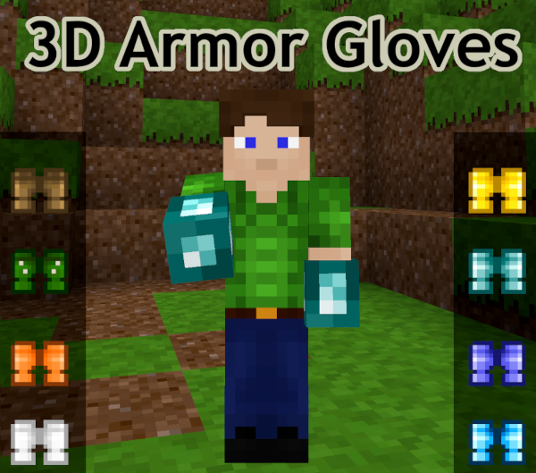

minetest mod 3d_armor_gloves
=======================

ARMOR gloves/gauntlets to the 3d_armor mod

## Information
--------------

This mod provides ARMOR gloves/gauntlets fully compatible with all engines, using 3d_armor mod.

- Gloves/Gauntlets are present in all the standard 3d armor material types
- Gloves/Gauntlets provide approximately the same bonus as boots.



## Technical info
-----------------

This mod must be named `3d_armor_gloves` and is a MinenuX fork improved to work 
with all engines, also provides som minor fixeds

It can be downloade from 
* https://git.minetest.io/minenux/minetest-mod-3d_armor_gloves
* https://codeberg.org/minenux/minetest-mod-3d_armor_gloves

#### Compatibility

Make sure you are using Minetest 0.4.16+ and start a new world (anything but v6), 
then enable Ethereal in the mods list.

#### Dependencies

* default
* Farming Redo `farming` or normal farming from default game
* 3d_armor


#### Crafting

The mod provides a fishing api, basically is `ethereal.add_item(fish, junk, bonus)`,
several examples are at the documentation of [api.txt](api.txt) file.

```
+---+---+---+
| X |   | X |
+---+---+---+
| S |   | S |
+---+---+---+
|   |   |   |
+---+---+---+
```

#### Nodes

Those are the nodes used in craft guide

| 3d_armor_gloves                  | X must be               | S must be         |
| -------------------------------- | ----------------------- | ----------------- |
| [3d_armor_gloves:gloves_wood]    | [default:wood]          | [farming:string]  |
| [3d_armor_gloves:gloves_cactus]  | [default:cactus]        | [farming:string]  |
| [3d_armor_gloves:gloves_steel]   | [default:steel_ingot]   | [farming:string]  |
| [3d_armor_gloves:gloves_bronze]  | [default:bronze_ingot]  | [farming:string]  |
| [3d_armor_gloves:gloves_diamond] | [default:diamond]       | [farming:string]  |
| [3d_armor_gloves:gloves_gold]    | [default:gold_ingot]    | [farming:string]  |
| [3d_armor_gloves:gloves_mithril] | [moreores:mithril_ingot] | [farming:string]  |
| [3d_armor_gloves:gloves_crystal] | [ethereal:crystal_ingot] | [farming:string]  |

## LICENSE

Lasted  features, non comercial unless xpresed permission:

 Copyright (C) 2023 mckaygerhard - CC-BY-SA-NC 4.0

Source code base: GPLv2.1

 Copyright (C) 2012-2019 stujones11, Stuart Jones <stujones111@gmail.com>

License Textures: CC-BY-SA 3.0

 Copyright (C) 2017-2019 davidthecreator - CC-BY-SA 3.0

